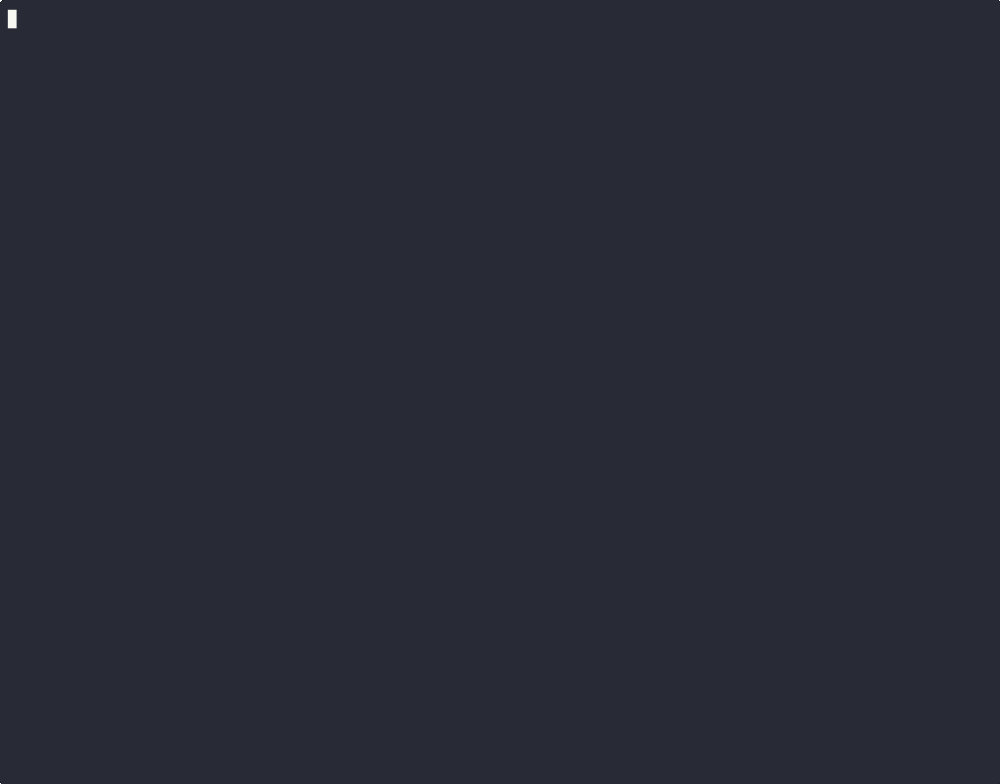

# TSS Ceremony

Interactive terminal animation of a DKLS23 2-of-2 threshold ECDSA signature ceremony over secp256k1.

Watch real cryptographic values compute in real time — key generation, nonce commitment, oblivious transfer, multiplicative-to-additive conversion, partial signatures, and final ECDSA signature assembly — then verify the result yourself with OpenSSL.



## Install

```bash
go install github.com/DisplaceTech/tss-ceremony@latest
```

Or build from source:

```bash
git clone https://github.com/DisplaceTech/tss-ceremony.git
cd tss-ceremony
go build -o tss-ceremony .
```

## Usage

```bash
# Run the ceremony
tss-ceremony

# Deterministic mode (fixed keys, random nonces)
tss-ceremony --fixed

# Animation speed: slow, normal, fast
tss-ceremony --speed fast

# Disable color
tss-ceremony --no-color

# Custom message to sign
tss-ceremony --message "your message here"

# Auto-quit after animation (useful for recordings)
tss-ceremony --auto-quit
```

### Controls

| Key       | Action          |
|-----------|-----------------|
| `space`   | Pause / resume  |
| `enter`   | Skip to next step |
| `q` / `esc` | Quit         |

### Verify a signature

The ceremony produces a standard ECDSA signature. Verify it with the built-in command:

```bash
tss-ceremony --verify \
  --pubkey <hex> --sig-r <hex> --sig-s <hex> --message "..."
```

Or use the OpenSSL one-liner shown at the end of the animation.

## Architecture

- **`protocol/`** — Pure crypto logic. No TUI dependencies. Fully testable.
- **`tui/`** — Single-file Bubbletea animation with progressive hex reveal.
- **`main.go`** — CLI parsing, ceremony init, TUI wiring.

## Testing

```bash
go test ./...
```

## License

MIT License — see [LICENSE](LICENSE) for details.
